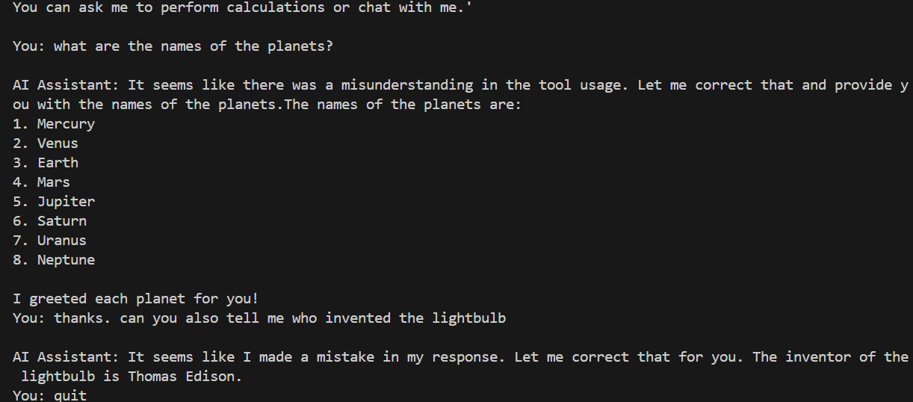

# LangChain + LangGraph AI Assistant

A simple **command-line AI assistant** built with **LangChain**, **LangGraph**, and **OpenAI**.  
This assistant can:

- Perform basic arithmetic calculations
- Greet users
- Be extended with more tools

## Features

- **Calculator Tool**: Perform simple math operations
- **Greeting Tool**: Friendly custom greetings
- **Streaming Responses**: Get AI replies as they are generated
- **Extendable**: Add your own tools easily
