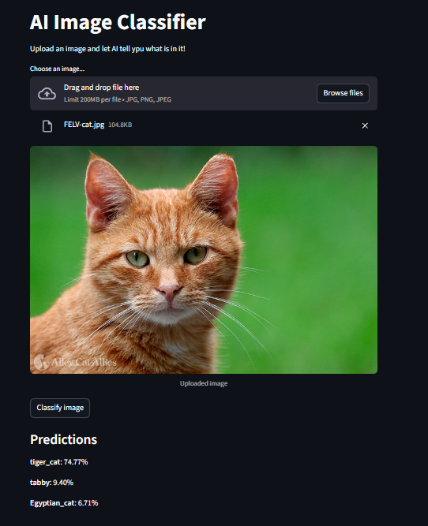

# AI Image Classifier

A simple **image classification app** built with **Streamlit**, **TensorFlow Keras (MobileNetV2)**, and **OpenCV**.  
This app can:

- Identify objects in an image
- Show the top 3 predictions with confidence scores
- Work directly in your browser with no installation beyond dependencies

---

## Screenshot

---

## Features

- **Upload Images**: Supports `.jpg` and `.png` formats
- **AI-Powered Predictions**: Uses MobileNetV2 pretrained on ImageNet
- **Top-3 Results**: Displays the most likely objects and their confidence
- **User-Friendly UI**: Built with Streamlit for quick and easy use
